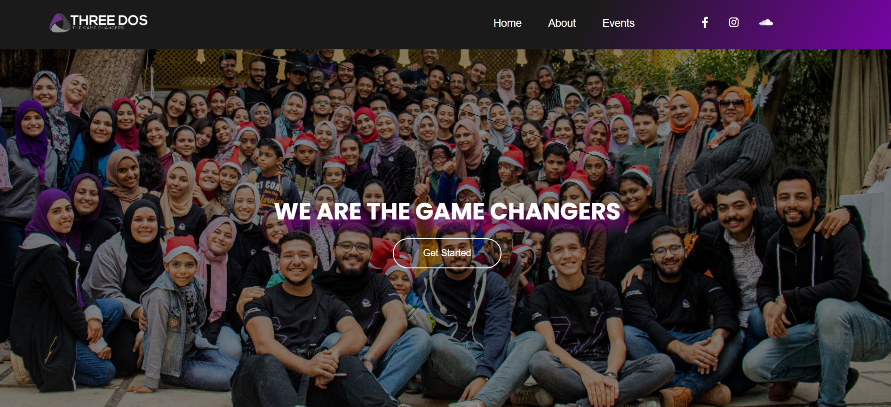

# Three-Dos App

An experimental to-do style web app with a creative and animated interface. Built using HTML, CSS, and JavaScript to demonstrate dynamic interactions and fun UI/UX concepts.

## 🔗 Live Demo
[Live Site](https://momen-sayed0.github.io/Three-Dos/)

## 📂 Repository
[GitHub Repository](https://github.com/momen-sayed0/Three-Dos)

---

## 🛠️ Built With

- HTML5
- CSS3
- JavaScript (Vanilla JS)

---

## ✨ Features

- Animated to-do-style interface.
- Add and remove "Dos" with smooth interactions.
- Clean visual structure and unique layout.
- Focused on DOM interaction and styling.

---

## 📷 Screenshot

---

## 🧑‍💻 Author

**El Mo'men Bellah Sayed**  
[GitHub Profile](https://github.com/momen-sayed0)

---

## 📌 License

This project is open-source and free to use.
